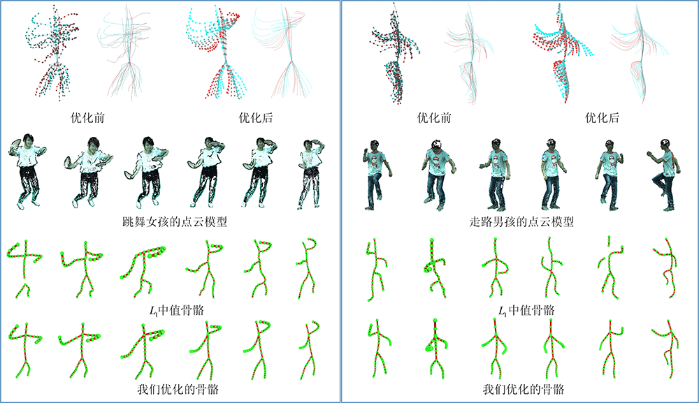
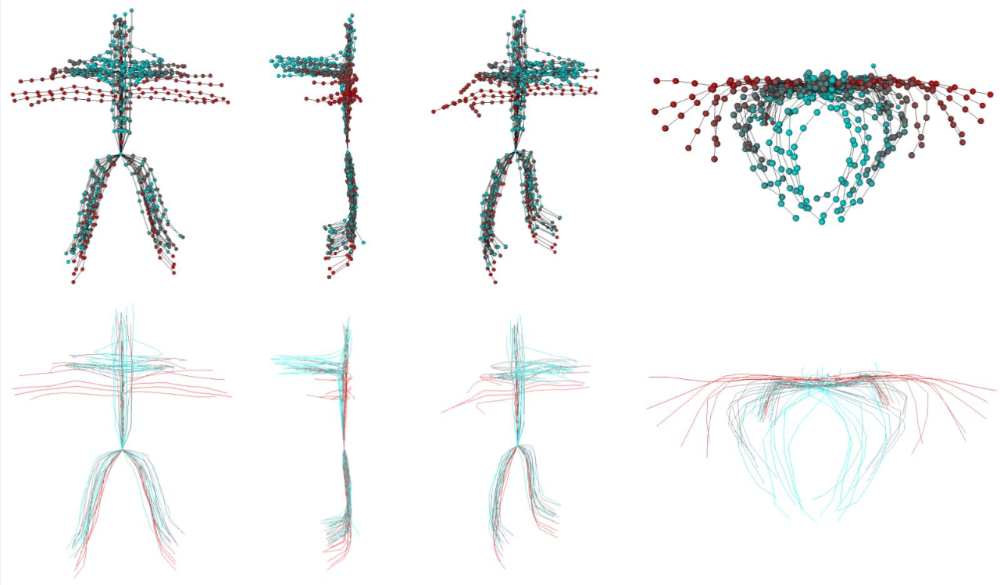
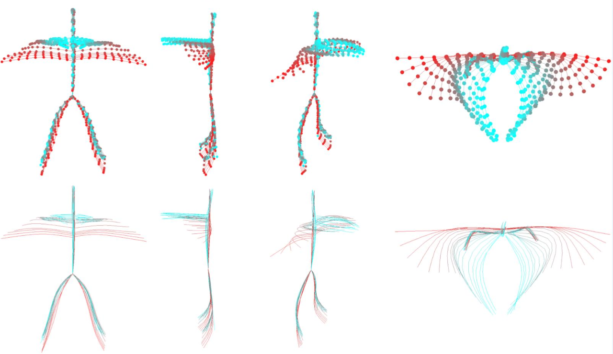

# L0-regularization-based skeleton optimization from consecutive point sets of kinetic human body

## Requirements

- OSG 3

## Example Results

- The skeletons of kinetic human body before optimization

- The skeletons after our optimization

